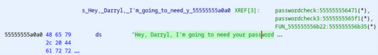
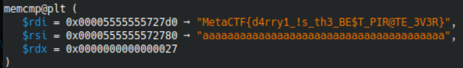

# Darryl Vault
Dread Pirate Darryl has no qualms with a little bit - or a lot - of thievery, as you recently found out to your detriment. Suffice it to say his loot stash has grown quite a bit, and you find yourself down a whole bunch of valuables. This is, put simply, unacceptable. You need to rectify this situation, and returning the favor ought to do the trick.

As a Dread Pirate, Dread Pirate Darryl has much better things to do than remembering all of his secrets, such as raiding other innocent CTF-goers or shouting "ARRRRR" at the top of his lungs repeatedly. Darryl commissioned a secret vault program to be written for him so that when he needs to take newly acquired loot back to his lair, he can ask it where he has to go.

Unfortunately for Dread Pirate Darryl, the developer from whom he commissioned the vault was very proud of his work and wanted to show it off, and we here at MetaCTF have acquired a copy of it. Find Dread Pirate Darryl's treasures! Enact your revenge!

Note: The flag is the password used to access the location of Dread Pirate Darryl's treasure.

## Solve
First, i just ran the file to see what was going on and saw that there were four different options. 
I went to ghidra, looked at the entry, got the first argument of libc start main and renamed main 
Rebase Ghidra 
Break main and look at what it’s doing
We have four possible inputs, right? 
1, 2 3, 4

Mother’s maiden name does not prompt for a password

The password for 2&3 is just chilling in strings DARRYL_IS_THE_GREATEST

4 asks for a password, but it doesnt output anything else. Hmmmmmmmmmmmm 👀

Essentially, the password is checked on three separate occasions
We return to ghidra. Defined strings go burrrrr. “Hey, Darryl, I'm going to need your password” has three functions nearby it. Three???? hmmmmmmmmmmmmmmm

Why dont we click on those functions 👀 

Oh cool that last one looks sexy 

This is where i found the function i named funcwithtoomanynums. U will know it when u see it

Inside that, the memcmp 0x27 goooo burrrrrr 

Let’s just fuck around in gdb and break at this memcmp with ‘aaaaaaaaaaaaaaaaaaaaaaaaaaaaaaaaaaaaaaa’ bc its len is 0x27

Gdb go burrrrrr
ty gdb v cool

