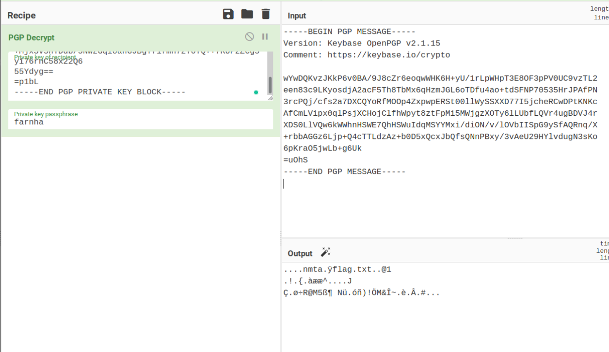

# Easy as it is
Caleb was designing a problem for MetaCTF where the flag would be in the telnet plaintext. Unfortunately, he accidentally stopped the packet capture right before the flag was supposed to be revealed. Can you still find the flag? Note: You'll need to decrypt in CyberChef rather than using a command line utility. 

## Solve
Get the PGP message and private key from the pcap. Put it in CyberChef and notice it is still messed up. So, mess around with the decrompression and find that `gzip` works.

`MetaCTF{cleartext_private_pgp_keys}`