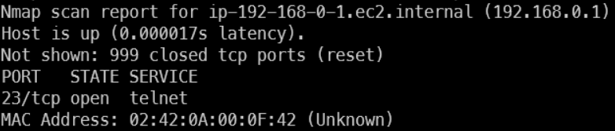
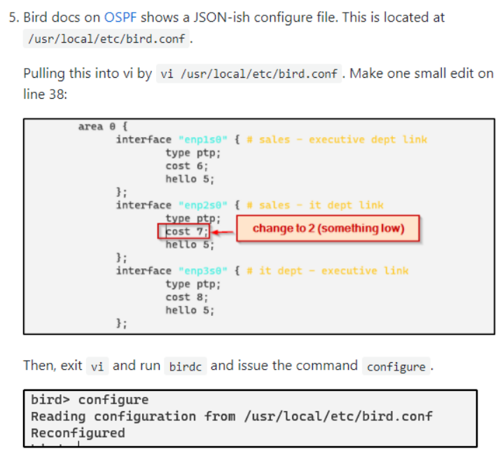

# Interception III
192.168.55.3 is periodically sending the flag to 172.16.0.2 over UDP port 8000. Go get it.
By the way, I've been told the admins at this organization use really shoddy passwords.
ssh ctf-f36ef72cadc1@host.cg21.metaproblems.com -p 7000
Note: The password for this user is the flag from Interception I. You must finish Interception I before starting this challenge. 

## Solve
First enumerate.... `nmap -v 192.168.0.0/24`



So... telnet means we can connect to smtn... we know it is a router bc usually default gateways have an end address of <0-9>.<0-9>.<0-9>.**1**

Gotta identify the router

`nmap -O 192.168.0.1`

```
Starting Nmap 7.92 ( https://nmap.org ) at 2021-12-05 08:57 UTC
Nmap scan report for ip-192-168-0-1.ec2.internal (192.168.0.1)
Host is up (0.000077s latency).
Not shown: 999 closed tcp ports (reset)
PORT   STATE SERVICE
23/tcp open  telnet
MAC Address: 02:42:0A:00:0F:42 (Unknown)
Device type: general purpose
Running: Linux 4.X|5.X
OS CPE: cpe:/o:linux:linux_kernel:4 cpe:/o:linux:linux_kernel:5
OS details: Linux 4.15 - 5.6
Network Distance: 1 hop
```

Important: **Linux 4.15-5.6**

google search: routers that use Linux 4.15 - 5.6 -> TP-Link

Find root login -> [TP Link Default Creds](https://www.cleancss.com/router-default/TP-Link)

```
username: root
password: admin
```

When you get access, and do an `ls`, find bird-2.0.8 ->
https://blog.kintone.io/entry/bird and https://bird.network.cz/?get_doc&f=bird-4.html

Did not solve, but was ON THE RIGHT TRACK. At 4AM, I tried changing the OSPF cost BUT I CHANGED THE WRONG INTERFACE'S COST. BIG SAD.

Here is the writeup from another person... for next time.



