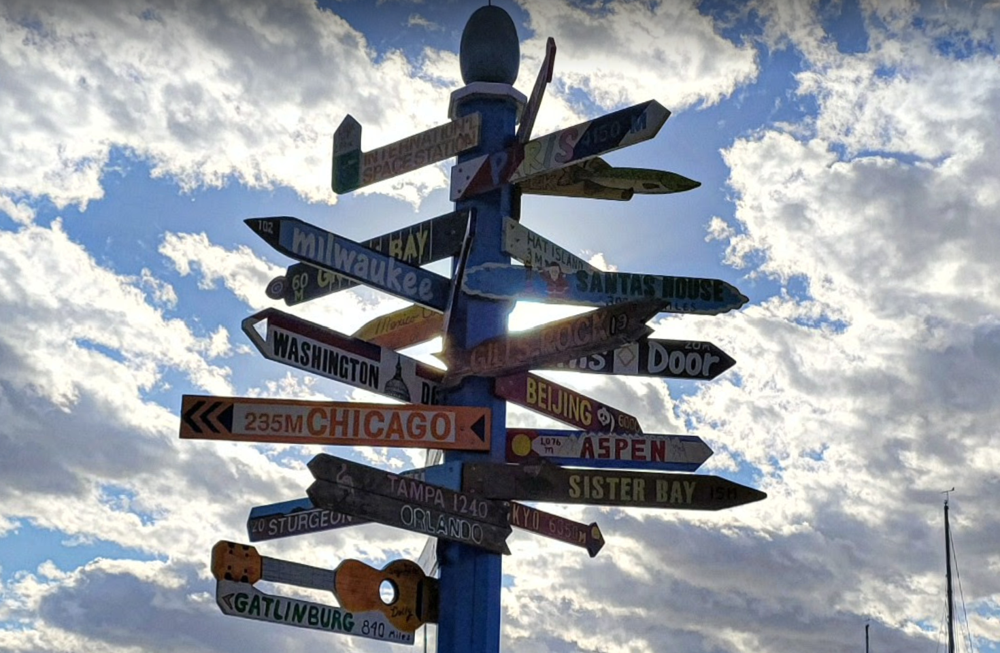

# Where in the World
I must say, every time I see one of these directional signs, I think I've got to make this into a CTF problem. It's the idea of Open Source Intelligence (OSINT) or Geospatial Intelligence (GEOINT). The idea of being able to take an image and use all of the clues within it to infer details such as where it's at or what's happening in the photo.

Here is one such picture of those signs. Your goal? Use those little details to find the name of the marina it's at which you'll submit for the flag (so MetaCTF{name of marina}

## Solve
Google image search go brrrr.

[Search](https://www.google.com/search?tbs=simg:CAESYgm4egF4qbenjhpXCxCwjKcIGjsKOQgEEhSLHvcB1A2jDM8esSSJJsYRqS2wGhobsSNyV5t0GyxbYWZWX4cdF4DSw67Sa_1SydHZ0IAUwBAwLEI6u_1ggaCgoICAESBAXC5ToM&q=marina+&tbm=isch#imgrc=lI4Z2r9ahay2oM)

[Egg Harbor](https://www.google.com/url?sa=i&url=https%3A%2F%2Fwww.facebook.com%2FEgg-Harbor-Marina-Beach-206274509466545%2F&psig=AOvVaw19faRmXpPwUl5JjE_6oYTM&ust=1638681451821000&source=images&cd=vfe&ved=0CAwQjhxqFwoTCJCsmqGyyfQCFQAAAAAdAAAAABAD)

`MetaCTF(egg_harbor)`